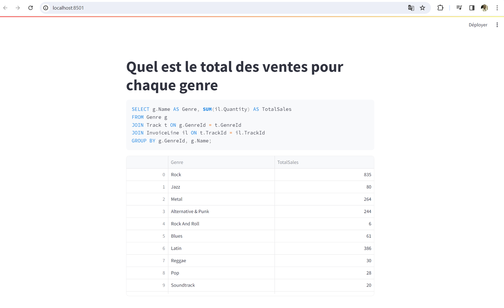
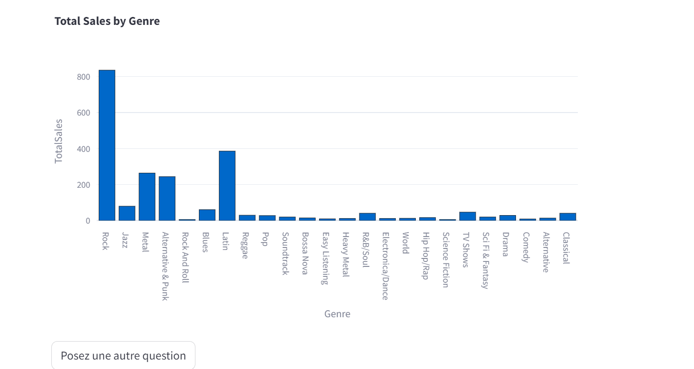
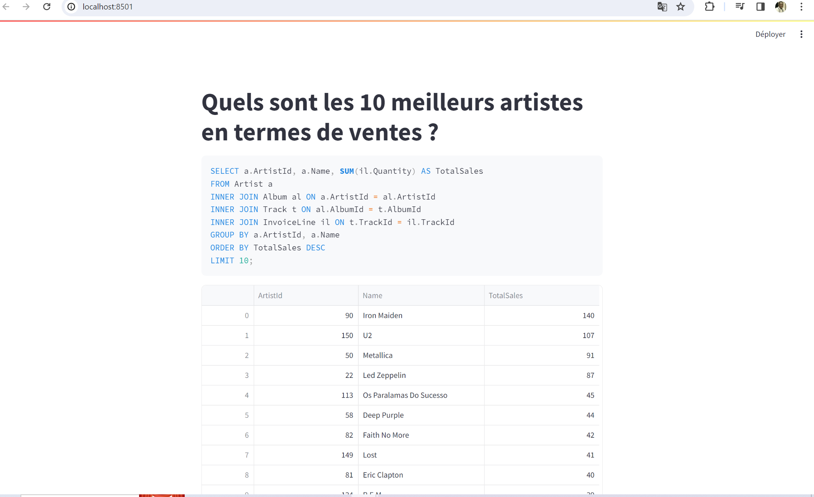
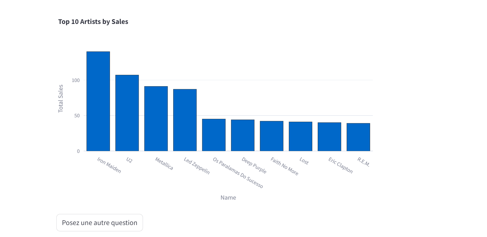

# **Créez un Chatbot pour votre base de données SQL à l'aide de Python, Streamlit et Vanna**
 - Nous allons d’abord importer les 2 packages Python que nous utiliserons : Streamlit et Vanna.
   - [**Streamlit**](https://streamlit.io/) fournit l' interface utilisateur
   - [**Vanna**](https://vanna.ai/) fournit l'infrastructure nécessaire pour utiliser un LLM (c'est-à-dire une IA) pour générer du SQL
## Installation
 - Ici, nous utuliserons notre clé API Vanna, qu'on pourra récupérer sur le site [**Vanna**](https://vanna.ai/).
 - Ensuite nous définirons le modèle d'augmentation de récupération Vanna sur **chinook** qui contient des métadonnées pour cette base de données, et nous nous connecterons à la base de données SQLite, ce qui nous permettra 
  d'exécuter le SQL généré.

## Executez le projet
 - Par mesure de bonne pratique, créez un environnemnt:
   - **python3 -m venv venv-sql**.
   - **./venv-sql/Scripts/activate** (activate the environment for Windows).
   - **source venv-sql/bin/activate** (activate the environment for Mac and Linux ).
 - Installez les pré-requis: **pip install -r requirements.txt**
 - Tapez **streamlit run app_test.py** (visionnez avec streamlit) ou **python app.py** (visionnez avec flask)

## Produit Final
 - Regardons le produit final. À partir d'un exemple de base de données SQLite contenant des informations sur les ventes de disques,
    nous pouvons créer une zone de texte qui vous permet de poser n'importe quelle question en langage naturel.
- Maintenant posons une question à notre IA : **What is the total sales for each genre?** et regardons les réponses attendus
   - 
   - 
- Posons une autre la question à notre IA : **What are the top 10 artists by sales?** et regardons les réponses attendus
  - 
  - 
