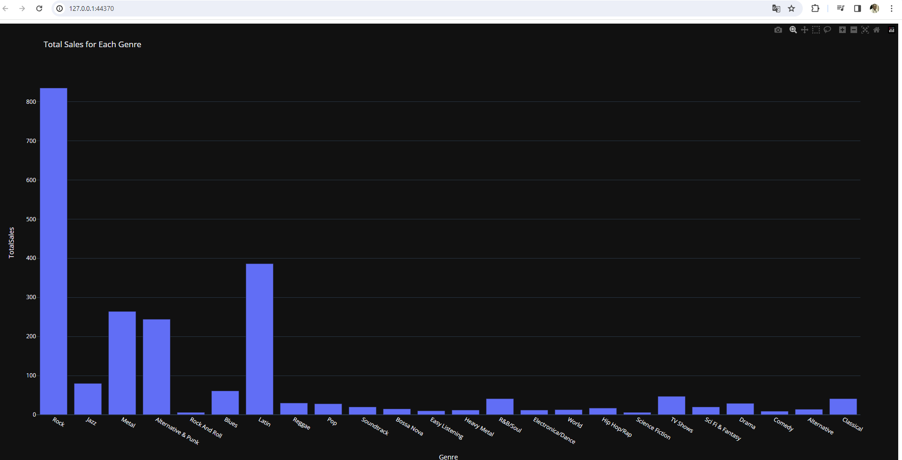

# 🤖 Chatbot SQL avec Python, Streamlit & Vanna


[](https://github.com/pre-commit/pre-commit)
[](https://github.com/psf/black)


## 📌 Contexte

Ce projet a été développé en **Mars 2024** avec la version **Vanna 0.20.0**.
Il illustre une intégration complète entre un **LLM (Vanna)** et une base SQL (Chinook), avec une interface moderne en **Streamlit** ou **Flask**.

⚠️ **Attention : depuis lors, l’API Vanna a évolué.**
Certaines méthodes du SDK Python ont changé ou ne sont plus disponibles. Le code de ce repo ne fonctionne donc plus tel quel avec les versions récentes.
👉 Ce repo reste néanmoins une **démonstration solide** de :
- Intégration d’un LLM avec une base SQL
- Mise en place d’une app Streamlit
- Qualité de code (pre-commit)
- Documentation claire et pédagogique

---

## 🎯 Objectif

Ce projet a été développé en 2024 avec **Vanna 0.20.0**.
L’objectif est de démontrer une intégration technique complète entre un **LLM (Vanna)** et une base SQL (Chinook), avec une interface moderne en **Streamlit** ou **Flask**.

Il met en avant :
- La génération automatique de requêtes SQL à partir de texte libre
- L’exécution et la visualisation des résultats dans une app interactive
- Qualité de code du projet (pre-commit hooks, pyproject.toml)
- Une documentation claire et structurée

⚠️ Depuis lors, l’API Vanna a évolué. Certaines méthodes du SDK Python ne sont plus disponibles, mais ce repo reste une **vitrine technique** solide de mes compétences en Data Engineering, MLOps et industrialisation.

---

## 🚀 Fonctionnalités
- Interface utilisateur interactive avec **Streamlit** et alternative **Flask**.
- Génération automatique de requêtes SQL à partir de texte libre via **Vanna LLM**.
- Exécution des requêtes sur une base SQLite (exemple : ventes de disques).
- Visualisation des résultats sous forme de **tableaux et graphiques**.

---

## 🛠️ Technologies utilisées

- **Python 3** – langage principal
- **Streamlit** – interface utilisateur interactive
- **Flask** – alternative légère pour servir l’application
- **Vanna LLM** – génération automatique de requêtes SQL à partir de texte libre
- **SQLite** – base de données de démonstration
- **pre-commit** – hooks pour garantir la qualité du code
- **Black** – formatage automatique du code
- **isort** – organisation des imports
- **Flake8** – analyse statique et respect des conventions PEP8

---

## 🛠️ Installation

1. Créez un environnement virtuel :
```bash
   python3 -m venv venv-sql
   source venv-sql/bin/activate   # Mac/Linux
   .\venv-sql\Scripts\activate    # Windows
```
---

2. Installez les dépendances :

```bash
    pip install -r requirements.txt
```
---

3. Configurez votre clé API Vanna dans app.py et app_test.py

4. 🚀 Démarrage rapide

```bash
streamlit run app.py # sur streamlit
python app_test.py   # ou sur Flask
```
---

## 📊 Exemple de résultats

 ### Question 1 : *What is the total sales for each genre?* (Streamlit)
- SQL généré + tableau des ventes par genre


---

### Question 2 : *What are the top 10 artists by sales?* (Streamlit)
- SQL généré + tableau des artistes


---

### Question 3 : *What is the total sales for each genre?* (Flask)
- SQL généré + tableau des ventes par genre


---

## ⚙️ Hooks + Documentation
Ce projet inclut :

- pre-commit hooks pour assurer la qualité du code (linting, formatage).

- Documentation GitHub Pages via index.md.

---

## 📚 Ressources

- [**Streamlit**](https://streamlit.io/) Streamlit – Interface utilisateur interactive
- [**Vanna**](https://vanna.ai/)– LLM pour générer SQL

---

## ⚠️ Limitations
Ce projet a été conçu avec Vanna 0.20.0 (2024).

Depuis certaines API Vanna ont changé → le code n’est plus directement exécutable avec les versions récentes.

Sur l’interface Vanna (dashboard cloud), le training data avec l’agent fonctionne correctement.

En revanche, en local avec le SDK Python, le training nécessite désormais une validation par email pour fonctionner, ce qui limite la reproductibilité sans credentials.

Ce repo reste une vitrine pédagogique et technique : il illustre l’intégration, la documentation et l’industrialisation, même si l’API sous-jacente a évolué.

---

## Lien vers mon portfolio
👉 🌐 [Voir le portfolio GitHub Pages](https://souleymanesow.github.io/Build-Chatbot-For-SqlDatabase/)
