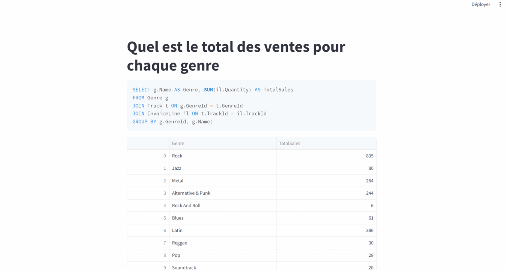

# 🤖 Chatbot SQL avec Python, Streamlit & Vanna


[](https://github.com/pre-commit/pre-commit)
[](https://github.com/psf/black)


Bienvenue sur la documentation de mon projet **Chatbot SQL**.  . Je suis **Souleymane Sow**, Data Engineer passionné par l’automatisation et l’optimisation des solutions data.
Ce projet a été développé en **Mars 2024** avec la version **Vanna 0.2.0** et illustre une intégration complète entre un **LLM (Vanna)** et une base SQL (Chinook), avec une interface moderne en **Streamlit** ou **Flask**.

---

## 📌 Contexte

⚠️ Depuis lors, l’API Vanna a évolué.
Certaines méthodes du SDK Python ont changé ou ne sont plus disponibles. Le code de ce repo ne fonctionne donc plus tel quel avec les versions récentes.

👉 Ce projet reste néanmoins une **démonstration solide** de :
- Intégration d’un LLM avec une base SQL
- Développement d’une app interactive avec Streamlit
- Mise en place de hooks de qualité
- Documentation claire et transparente

---

## 🎯 Objectif
Ce projet a été conçu en 2024 avec **Vanna 0.2.0** pour montrer comment un **LLM** peut interroger une base SQL en langage naturel et afficher les résultats dans une interface simple et visuelle.

Objectifs principaux :
- Illustrer la puissance d’un chatbot capable de transformer une question en langage naturel en requête SQL
- Montrer l’expérience utilisateur avec **Streamlit** : poser une question → obtenir un tableau et un graphique
- Valoriser mes compétences en structuration de projet, documentation et automatisation (CI/CD, qualité de code)
- Être transparent sur les évolutions techniques : l’API Vanna a changé depuis 2025, mais ce projet reste une **démonstration pédagogique et professionnelle**

---

## 🚀 Fonctionnalités

- Interface utilisateur interactive avec **Streamlit** et alternative **Flask**
- Génération automatique de requêtes SQL à partir de texte libre via **Vanna LLM**
- Exécution des requêtes sur une base SQLite (exemple : ventes de disques)
- Visualisation des résultats sous forme de **tableaux et graphiques**

---

## 🛠️ Technologies utilisées

- **Python 3** – langage principal
- **Streamlit** – interface utilisateur interactive
- **Flask** – alternative légère pour servir l’application
- **Vanna LLM** – génération automatique de requêtes SQL à partir de texte libre
- **SQLite** – base de données de démonstration(Chinook.sqlite)
- **pre-commit** – hooks pour garantir la qualité du code
- **Black** – formatage automatique du code
- **isort** – organisation des imports
- **Flake8** – analyse statique et respect des conventions PEP8

---

## 🚀 Démarrage rapide
```bash
python streamlit run app.py # sur Streamlit
python app_test.py    # ou sur FLask
```
---

## 📊 Démonstration

### Question : *What is the total sales for each genre?*


---

### Question : *What are the top 10 artists by sales?*


---

### Question : *What is the total sales for each genre?* (Flask)


---

## ⚙️ Hooks + Documentation

- **pre-commit** hooks pour garantir la qualité du code.

- **Documentation GitHub Pages** via ce fichier `index.md`
---

## ⚠️ Limitations
Ce projet a été conçu avec Vanna 0.2.0 (2024).

Depuis certaines API Vanna ont changé → le code n’est plus directement exécutable avec les versions récentes.

Sur l’interface Vanna (dashboard cloud), le training data avec l’agent fonctionne correctement.

En revanche, en local avec le SDK Python, le training nécessite désormais une validation par email pour fonctionner, ce qui limite la reproductibilité sans credentials.

Ce repo reste une vitrine pédagogique et technique : il illustre l’intégration, la documentation et l’industrialisation, même si l’API sous-jacente a évolué.

---

## 🎥 Démo interactive

Voici une démonstration de l’application Streamlit en action :



---

## 📂 Voir le code sur GitHub
👉 [Lien pour voir le code sur Github](https://github.com/SouleymaneSow/Build-Chatbot-For-SqlDatabase)
